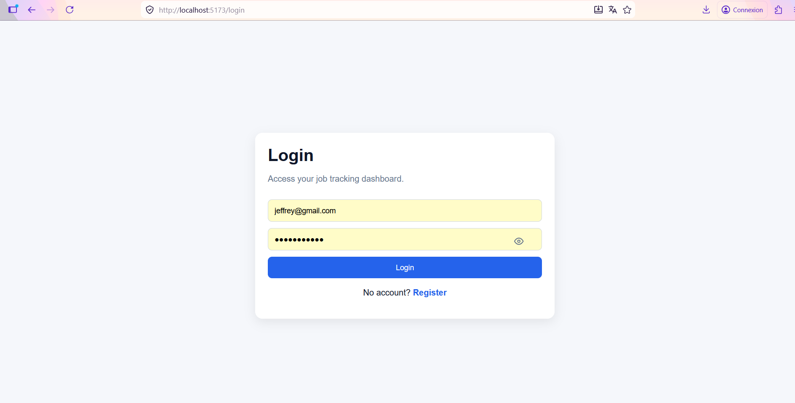
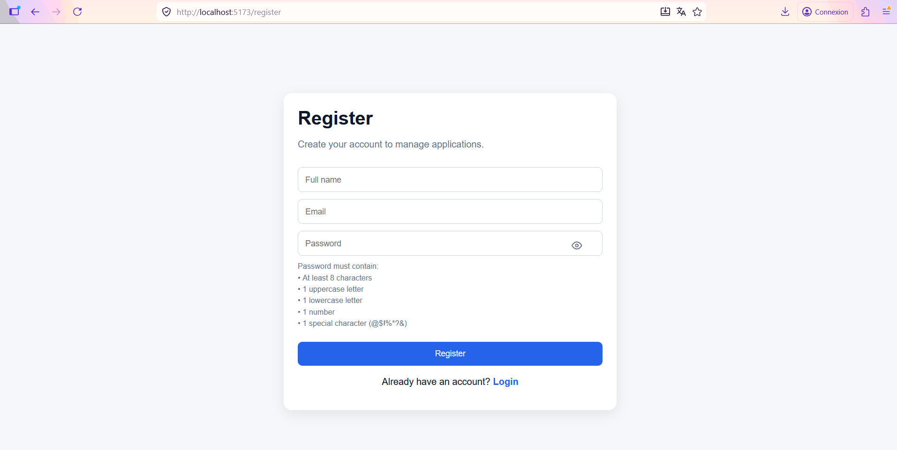
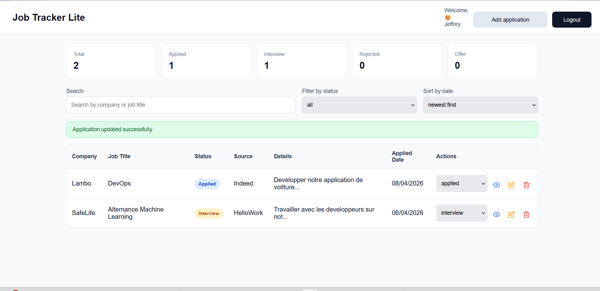
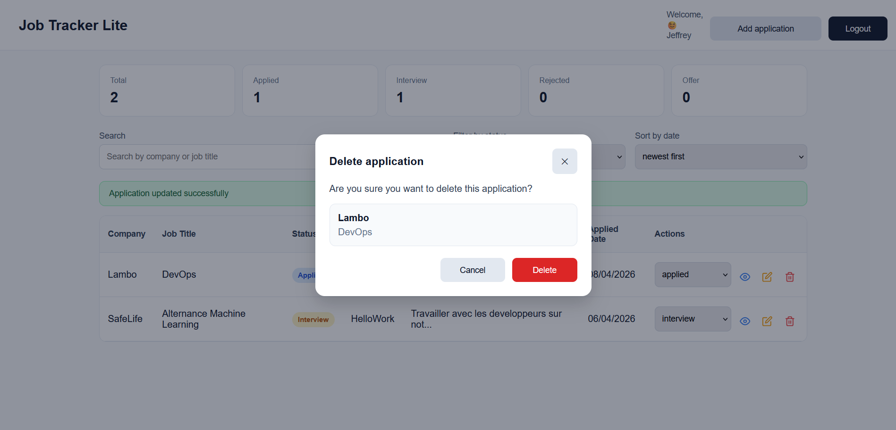

# 🚀 Job Tracker Lite

Application web full-stack permettant de gérer et suivre efficacement ses candidatures.

---

## 🎯 Objectif

Ce projet a pour objectif d’aider les utilisateurs à :
- Centraliser leurs candidatures
- Suivre l’évolution des statuts (applied, interview, rejected, offer)
- S’organiser efficacement dans leur recherche d’emploi

---

## 🛠 Stack technique

### Frontend
- React (Vite)
- React Router
- Axios
- React Icons

### Backend
- Node.js
- Express.js
- Prisma ORM
- PostgreSQL

### Authentification
- JWT (JSON Web Token)
- Bcrypt (hash des mots de passe)

---

## ✨ Fonctionnalités

- 🔐 Authentification (inscription / connexion)
- ➕ Ajout de candidatures
- ✏️ Modification d’une candidature
- ❌ Suppression avec confirmation (modal)
- 👀 Visualisation des détails
- 🔄 Mise à jour du statut
- 🔍 Recherche (entreprise / poste)
- 🎯 Filtrage par statut
- 📅 Tri par date
- 📄 Pagination
- ⚠️ Gestion des erreurs (frontend + backend)
- 👁 Affichage / masquage du mot de passe

---

## 📸 Captures d’écran

### 🔑 Page de connexion

### 📝 Page d’inscription

### 📊 Dashboard

### 🗑 Confirmation de suppression

